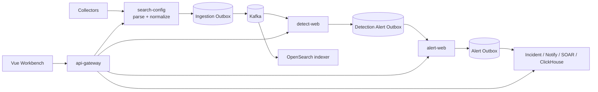

# SOCP SIEM

SOCP is a self-hosted, event-driven SIEM/SOC workbench built with Java 21,
Spring Boot, Kafka, PostgreSQL, OpenSearch, ClickHouse, Temporal, and Vue 3.
It covers ingestion, canonical normalization, stateful detection, alert
persistence, investigation, case management, and automated response.

This repository is a local development and verification platform. Its Docker
Compose environment is single-node and is not evidence of production HA or
capacity.

## Event path



Durable outboxes separate database commits from Kafka and service delivery.
Deterministic identities and replay-safe consumers provide at-least-once
delivery without claiming a distributed exactly-once transaction. See the
[architecture](docs/architecture.md) and
[Detection state contract](docs/detection-state-semantics.md) for the detailed
boundaries.

## Capabilities

- JSON, NDJSON, Syslog, CEF, LEEF, KV, Sysmon, auditd, and Falco ingestion.
- Stateful pattern, threshold, correlation, baseline, and rare-event rules.
- Durable journal, outbox, replay, DLQ, suppression, and partition-owned state.
- Alert, incident, asset, threat, notification, SOAR, and reporting workflows.
- JWT/OIDC, RBAC, logical tenant isolation, audit, metrics, and tracing.
- Versioned detection content, failure injection, and repeatable verification.

The executable Detection content pack lives at
`services/detect-web/src/main/resources/detection-content/manifest.json`.

<!-- detection-summary:start -->
**Detection content**: `39` rules (`39` ACTIVE), pack `socp-core-detections` version `2026.09.13` (schema `1`).
Types: baseline=3, correlation=2, correlation-set=1, pattern=18, rare=5, threshold=10. Statuses: ACTIVE=39.
ATT&CK techniques: `23`; data sources: `22` (alert, application, audit, auditd, auth, database, dlp, dns, edr, falco, firewall, linux, mail, netflow, nginx, proxy, risk, sshd, sysmon, waf, web, windows).
Manifest SHA-256: `5db827bd6aedb84e70d1de1082e11629bc8234bb1644e3e970a7b226b18196e0`.
<!-- detection-summary:end -->

## Quick start

Requirements: JDK 21, Git Bash or WSL, Node.js 22, Corepack/pnpm 10, Docker
Desktop, and preferably 24 GB RAM for the complete stack.

```bash
bash build/compose.sh up -d
bash build/mvnw.sh -DskipTests package
cd frontend && corepack pnpm install --frozen-lockfile && corepack pnpm build && cd ..
bash build/run-all.sh start core
```

Open `http://localhost:5173`. The disposable development account is
`demo / demo123`; never reuse it outside local development. See
[Getting started](docs/getting-started.md) for profiles, port overrides,
middleware options, and shutdown commands.

## Verification

Run the repository quality gate before merging:

```bash
bash build/quality-gate.sh
# Native PowerShell: .\build\quality-gate.ps1
```

Use the [testing guide](docs/testing.md) to select focused checks and the
[validation matrix](docs/validation-matrix.md) to understand their evidence
and cadence. Middleware, chaos, and full-stack checks require the corresponding
services and must run against a disposable environment.

## Runtime boundaries

- Delivery is at-least-once; durable writes must complete before terminal
  state or Kafka offsets advance.
- Stateful Detection correctness is partition-scoped and depends on canonical
  routing keys matching each rule's grouping field.
- Tenant isolation is logical (`tenant_id`, authorization, query filters, and
  production RLS checks), not physical database isolation.
- H2 and simulation are development conveniences, not production evidence.
- External connector, HA, capacity, backup/restore, and SLO acceptance remain
  deployment-specific.

The default local layout has 14 backend processes, but process count is not a
fixed architecture target. `python build/runtime-topology.py --check` validates
the executable registry, logical domains, and evidence-gated consolidation
candidates.

## Repository layout

```text
platform/                 shared auth, tenant, audit, observability, and rules
services/                 Spring Boot business services
frontend/apps/workbench/  Vue 3 security operations workbench
agents/                   collection assets
infra/                    local middleware and initialization
deploy/                   container and Kubernetes release assets
build/                    launchers, verification, chaos, and packaging
docs/                     architecture, contracts, testing, and operations
```

`bash build/package-release.sh` packages already-built artifacts; add `--build`
to build first. Generated archives and their `RELEASE.md` stay under the
ignored `dist/` directory.

## Documentation

- [Documentation index](docs/README.md)
- [Architecture](docs/architecture.md)
- [Getting started](docs/getting-started.md)
- [Module map](docs/module-map.md)
- [Testing guide](docs/testing.md)
- [Production readiness](docs/production-readiness.md)

## License

[MIT License](LICENSE)
