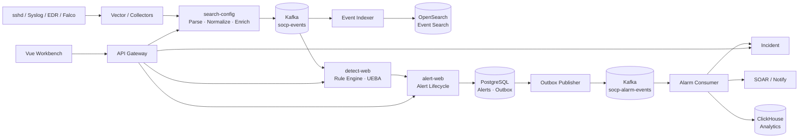

# SOCP SIEM

SOCP 是一个自托管、事件驱动的 SIEM/SOC 安全运营平台，用于接入异构安全日志，将原始遥测归一化为统一事件模型，并完成检测、告警、调查、案件流转与自动化响应。

项目采用 Java 21、Spring Boot 与 Vue 3 构建，提供可在单机环境运行和验证的完整安全事件处理链路。Kafka 负责事件解耦与积压恢复，PostgreSQL 保存告警和案件事实，OpenSearch 支撑原始事件检索，ClickHouse 承担分析聚合，Temporal 可用于 SOAR 工作流编排。

## 功能概览

- **日志接入与归一化**：支持 Vector、NDJSON 和采集端上报；解析 JSON、Syslog、CEF、LEEF、KV、Sysmon、auditd 与 Falco 等格式，并映射到 Canonical Event Schema。
- **检测工程**：支持 pattern、threshold、correlation、correlation-set、baseline 和 rare 规则，包含规则生命周期、热更新、抑制、事件去重与背压控制。
- **告警与调查**：提供告警生命周期管理、实时推送、原始事件检索、IOC 与 MITRE ATT&CK 上下文关联。
- **案件与响应**：支持告警自动建案和归并、人工建案、通知渠道、SOAR 剧本、失败重试与补偿。
- **资产与情报**：提供资产管理、批量导入、端点防护、威胁情报导入和 ATT&CK 技术管理。
- **平台治理**：包含 JWT/OIDC、RBAC、逻辑租户隔离、审计、限流、指标和跨 HTTP/Kafka 的 Trace Context 传播。

## 系统架构



### 关键设计

| 关注点 | 实现 | 设计目的 |
|---|---|---|
| 统一事件模型 | Canonical Event Schema + Parser Registry | 隔离不同厂商日志格式，检测规则只依赖稳定字段 |
| 事件传输 | Kafka、手动提交、幂等消费、DLQ | 解耦采集与检测，支持服务恢复后的积压处理 |
| 告警一致性 | PostgreSQL Transactional Outbox | 在同一事务内保存告警与待发布事件，避免跨系统双写 |
| 数据分工 | PostgreSQL + OpenSearch + ClickHouse | 分离事务状态、全文检索和分析聚合负载 |
| 自动化响应 | Temporal Workflow / 本地执行器 | 提供持久化编排、重试和补偿，并支持本地开发降级 |
| 安全治理 | JWT/OIDC、RBAC、Tenant Context、Audit | 统一身份、权限、租户上下文和操作留痕 |

系统采用 at-least-once 交付语义。Kafka 消费者通过事件 ID 去重和幂等写入处理重复投递；告警 Outbox 可重试发布，不声明跨 Kafka 与数据库的 exactly-once。

## 技术栈

- **后端**：Java 21、Spring Boot 3.5、Spring Cloud Gateway、MyBatis、Flyway
- **消息与存储**：Kafka、PostgreSQL、OpenSearch、ClickHouse、MinIO
- **工作流与可观测性**：Temporal、OpenTelemetry、Jaeger、Prometheus、Grafana
- **前端**：Vue 3、TypeScript、Vite、Element Plus、ECharts、TanStack Query
- **工程化**：Maven 多模块、pnpm workspace、Docker Compose、GitHub Actions

## 快速开始

### 环境要求

- JDK 21 与 Git Bash/WSL
- Node.js 22、Corepack 和 pnpm 10
- Docker Desktop
- 完整集成环境建议至少 24 GB 内存；日常开发可只启动相关服务切片

### 启动完整开发环境

```bash
git clone https://github.com/VincentXR/socp-siem.git
cd socp-siem

# 启动 PostgreSQL、Kafka、OpenSearch、ClickHouse 等中间件
docker compose -f infra/docker-compose.yml up -d

# 构建并启动后端
bash build/mvnw.sh -DskipTests package
bash build/run-all.sh backend

# 安装依赖并启动前端
cd frontend
corepack pnpm install --frozen-lockfile
cd ..
bash build/start-frontend.sh
```

访问 `http://localhost:5173`，本地演示账号为 `demo / demo123`。该凭据仅用于开发环境。

如需运行真实文件采集演示，可额外启动 Vector：

```bash
bash build/run-vector.sh start
python build/demos/golden-demo.py
```

使用以下命令查看或停止本地服务：

```bash
bash build/run-all.sh status
bash build/run-all.sh stop
docker compose -f infra/docker-compose.yml down
```

## 测试与验证

```bash
# Java 单元与模块测试
bash build/mvnw.sh test -Dsurefire.failIfNoSpecifiedTests=false

# 前端类型检查、测试和产物验证
cd frontend/apps/workbench
pnpm test
pnpm verify
cd ../../..

# 集成环境验证
python build/verify-slice.py
python build/verify-pipeline.py
python build/verify-full.py
python build/failure-tests.py
```

`verify-pipeline.py` 验证事件进入 Kafka、检测命中、告警落库、OpenSearch 索引和 ClickHouse 明细写入。`failure-tests.py` 覆盖 Kafka、OpenSearch、Temporal 和 PostgreSQL 的停止与恢复场景。GitHub Actions 在推送和 Pull Request 时执行后端测试、前端验证、最小服务切片及真实事件管线 E2E。

## 运行配置与边界

- 启动脚本使用 `dev` profile 提供本地演示账号，并采用 PostgreSQL 与文件型 H2 混合持久化。
- 默认使用 H2 的有状态服务可启用 `pg` profile 切换到 PostgreSQL；完整集成验证同时接入 Kafka、OpenSearch 和 ClickHouse。
- `prod` profile 启用启动守卫，拒绝 H2、默认密钥、认证绕过、默认采集令牌和禁用 Temporal。生产配置可组合启用 `pg,prod`。

当前实现面向单机开发、演示和故障验证，不包含生产级高可用部署：

- 租户隔离基于 `tenant_id` 与统一查询过滤，不是独立数据库或物理隔离。
- Docker 环境使用单节点 Kafka、OpenSearch、PostgreSQL 和 ClickHouse。
- 检测窗口状态保存在进程内；水平扩展时需要按检测键稳定分区。
- AI 助手使用内置安全知识库，默认不调用外部大模型服务。

## 项目结构

```text
socp-siem/
├── platform/                  # 鉴权、租户、审计、可观测性、规则引擎等共享模块
├── services/                  # 接入、检测、告警、案件、SOAR、资产、情报等业务服务
├── frontend/apps/workbench/   # Vue 3 安全运营工作台
├── frontend/packages/         # 前端共享包
├── agents/                    # Vector、Falco 与采集配置
├── infra/                     # Docker Compose、中间件配置和初始化脚本
├── build/                     # 启停、验证、故障注入与演示脚本
└── docs/                      # 架构、测试、运行指南和 ADR
```

## 文档

- [架构说明](docs/architecture.md)
- [模块地图](docs/module-map.md)
- [启动指南](docs/getting-started.md)
- [测试指南](docs/testing.md)
- [Golden Demo 清单](docs/demo-checklist.md)
- [架构决策记录](docs/adr/)

## License

本项目采用 [MIT License](LICENSE)。
