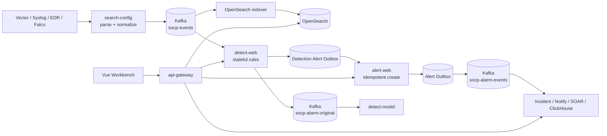

# SOCP SIEM

SOCP is a self-hosted, event-driven SIEM/SOC workbench built with Java 21,
Spring Boot, Kafka, PostgreSQL, OpenSearch, ClickHouse, Temporal, and Vue 3.
It demonstrates a complete security-event path: heterogeneous ingestion,
canonical normalization, stateful detection, alert persistence, investigation,
case management, and automated response.

This repository is a local development and verification platform. Docker
Compose is single-node and is not a production HA deployment.

## Event path



The Detection Alert Outbox is the hand-off boundary between the stateful rule
engine and Alert Web. An alert is written with its deterministic source ID
before the detection worker continues. A scheduled publisher retries Alert Web
until it acknowledges the request, then publishes the optional detect-model
event. Alert Web has a second transactional Outbox for downstream fan-out.

## Implemented capabilities

- JSON, NDJSON, Syslog, CEF, LEEF, KV, Sysmon, auditd, and Falco parsing.
- Canonical event fields and stable tenant/entity Kafka routing keys.
- Pattern, threshold, correlation, correlation-set, baseline, and rare rules.
- Hot reload, suppression, bounded queues, manual Kafka commits, DLQ paths,
  event-ID de-duplication, and a bounded PostgreSQL/H2 recovery journal.
- Partition-owned state restore after restart and consumer rebalance.
- Detection Alert Outbox and Alert Web idempotency using `sourceAlertId`.
- Alert evidence, entity risk scoring, IOC enrichment, ATT&CK mapping,
  incidents, cases, notifications, SOAR playbooks, and reporting.
- JWT/OIDC, RBAC, logical tenant isolation, audit records, metrics, traces,
  benchmark tooling, and failure-injection scripts.

The versioned detection pack is at
`services/detect-web/src/main/resources/detection-content/manifest.json`.
The exact partition and recovery contract is in
`docs/detection-state-semantics.md`.

## Quick start

Requirements: JDK 21, Git Bash or WSL, Node.js 22, Corepack/pnpm 10, and
Docker Desktop. A full local stack is most comfortable with at least 24 GB RAM.

```bash
docker compose -f infra/docker-compose.yml up -d
cd frontend && corepack pnpm install --frozen-lockfile && corepack pnpm build && cd ..
bash build/mvnw.sh -DskipTests package
bash build/run-all.sh start core
```

Open `http://localhost:5173`. The disposable development account is
`demo / demo123`; never reuse it outside a local development environment.

Useful profiles:

```bash
bash build/run-all.sh start core   # Golden Demo and core event path
bash build/run-all.sh start ui     # Workbench business pages
bash build/run-all.sh start full   # All backend services and collectors
bash build/run-all.sh status
bash build/run-all.sh stop
```

## Verification

```bash
bash build/mvnw.sh test -Dsurefire.failIfNoSpecifiedTests=false
cd frontend/apps/workbench && pnpm test && pnpm verify && cd ../../..
python build/verify-slice.py
python build/verify-pipeline.py
python build/validate-detection-content.py
python build/failure-tests.py
```

Run the operational checks only against a disposable stack because they stop
and restart services:

```bash
python build/chaos-pipeline.py --scenario alert_web_restart
python build/chaos-pipeline.py --scenario detect_restart
python build/chaos-pipeline.py --scenario duplicate_delivery
```

For a multi-instance check, start two or more `detect-web` processes with the
`pg` profile, distinct ports, and the same `SOCP_KAFKA_GROUP_ID`. Then set
`DETECTION_INSTANCE_URLS` (the first URL is the instance controlled by
`run-all.sh`) and run:

```bash
DETECTION_INSTANCE_URLS=http://127.0.0.1:18082,http://127.0.0.1:28082 \
  python build/chaos-pipeline.py --scenario multi_instance --count 5
```

Benchmark commands and the JSON report schema are documented in
`docs/benchmark/README.md`. Do not claim production throughput from a local
benchmark; retain machine-specific output outside source control.

## Runtime boundaries

- Delivery is at-least-once. Kafka, database, and downstream services do not
  form an exactly-once distributed transaction.
- A stateful rule is strictly partition-local only when its grouping field
  matches the canonical event routing field.
- Journal replay is bounded by `SOCP_DETECT_STATE_RETENTION` (24 hours by
  default) and paginated by `SOCP_DETECT_STATE_REPLAY_PAGE_SIZE`; it is not
  truncated at a fixed row count.
- Tenant isolation is logical (`tenant_id` and query filters), not physical
  database isolation.
- H2 is a local convenience profile. Use PostgreSQL and `prod` guard checks
  for production-like validation.
- The AI assistant is a keyword-backed knowledge prototype; it is not an
  external LLM or RAG service.

## Repository layout

```text
platform/                 shared auth, tenant, audit, observability, rules
services/                 Spring Boot business services
frontend/apps/workbench/  Vue 3 security operations workbench
agents/                   Vector and Falco assets
infra/                    Docker Compose and middleware initialization
build/                    startup, verification, benchmark, chaos, demos
docs/                     architecture, operating guides, tests, and ADRs
```

## Documentation

- [Architecture](docs/architecture.md)
- [Detection state semantics](docs/detection-state-semantics.md)
- [Module map](docs/module-map.md)
- [Getting started](docs/getting-started.md)
- [Testing guide](docs/testing.md)
- [Validation matrix](docs/validation-matrix.md)
- [Benchmark guide](docs/benchmark/README.md)
- [Chaos guide](docs/chaos/README.md)
- [Golden Demo checklist](docs/demo-checklist.md)
- [Architecture decision records](docs/adr/)

## License

[MIT License](LICENSE)
