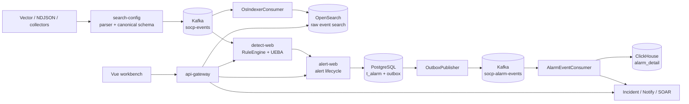

# SOCP SIEM Architecture

This document describes the current implementation as of 2026-08-15. The
repository README and executable code are the source of truth; this page is a
short architecture reference, not a historical design proposal.

## System shape

SOCP is a Java 21/Spring Boot monorepo with 28 Maven modules, 17 backend
services, one Vue workbench, and optional Docker middleware. The important
boundary is the event pipeline, not the service count:

## Responsibilities and storage

| Concern | Current implementation | Reason for the boundary |
|---|---|---|
| Ingestion and parsing | `search-config`, Vector, collector endpoints | Isolate vendor-specific formats from detection rules |
| Event transport | Kafka topics `socp-events`, `socp-rule-changes`, `socp-alarm-events` | Decouple producers and consumers; support replay and fan-out |
| Detection | `socp-rule` embedded in `detect-web` | JSON-configured rules, hot reload, window state and backpressure |
| Alert facts | `alert-web` + PostgreSQL `t_alarm` | Transactional lifecycle and tenant-filtered queries |
| Raw event search | OpenSearch, written by the Kafka consumer | Search and investigation workloads stay separate from OLTP |
| Analytical reporting | ClickHouse `alert_agg.alarm_detail` | Keep trend and aggregation queries off PostgreSQL |
| Response | `incident-web`, `notify-web`, `soar-web`, optional Temporal | Explicit workflow state, retries and compensation |

The default local profile uses PostgreSQL for `alert-web`, `incident-web`,
`soc-base`, and `threat-web`; nine stateful services use file-backed H2 with
Flyway migrations. The `pg` profile is available for those nine services.
Gateway, collectors, and reporting are stateless or read from other stores.

## Reliability semantics

- Kafka producers use `acks=all` and idempotence where configured.
- Consumers use manual commit, event-id deduplication, and DLQ/error paths.
- Detection applies bounded queue backpressure; ingest returns `503` with
  `Retry-After` when the queue cannot accept more events.
- Alert creation and its outbox row are written in one database transaction.
  The outbox publisher gives at-least-once delivery; consumers must remain
  idempotent. This is not an exactly-once claim.
- Temporal is optional in local development. SOAR falls back to the in-process
  executor when Temporal is unavailable; `prod` rejects that fallback.

## Security and tenancy

`socp-auth` validates HMAC or JWKS JWTs, extracts the tenant claim, and applies
method-level `@RequireRole` checks. Development may use the explicit
dev-bypass fallback; production must provide a real secret or issuer and uses
`ProdGuard` to reject demo credentials, H2, bypass authentication, and disabled
Temporal. Tenant isolation is logical (`tenant_id` plus SDK filters), not
physical database isolation.

## Operating modes

- `local`: fastest development, H2/file-backed services and optional middleware.
- `integration`: Docker middleware plus the real Kafka/OpenSearch/ClickHouse
  path; use `verify-pipeline.py` or `verify-full.py`.
- `prod`: environment-provided credentials and PostgreSQL, with fail-fast
  safety checks.

See [module-map.md](module-map.md), [getting-started.md](getting-started.md),
and the [architecture decision records](adr/) for implementation details.
