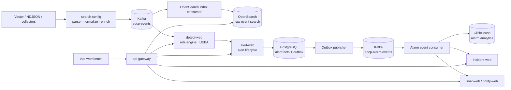

# SOCP SIEM Architecture

This document describes the implemented event pipeline, storage boundaries,
runtime configuration, and reliability semantics. Source code, migrations, and
executable verification scripts are the final source of truth.

## Event pipeline

`search-config` is the normalization boundary. It converts vendor-specific
input into a canonical security event before publishing to `socp-events`.
Detection and indexing consume the same event stream independently, so a
search outage does not block detection and a detection restart can process
Kafka backlog after recovery.

The normal path is a single publish to Kafka. `search-config` writes OpenSearch
directly only when Kafka is unavailable, as an explicit ingestion fallback;
Kafka-available operation does not perform a routine Kafka/OpenSearch dual write.

## Responsibilities and storage

| Concern | Implementation | Boundary |
|---|---|---|
| Ingestion and parsing | Vector, collectors, and `search-config` | Vendor-specific formats stay outside detection rules |
| Event transport | Kafka `socp-events`, rule-change events, and alarm events | Decouples producers, detection, indexing, and fan-out |
| Detection | `socp-rule` embedded in `detect-web` | JSON rules, hot reload, suppression, windows, and backpressure |
| Alert facts | `alert-web` and PostgreSQL | Transactional lifecycle and tenant-scoped queries |
| Event investigation | OpenSearch index consumer and search API | Full-text and field search stay separate from OLTP |
| Reporting | ClickHouse alarm detail consumer and `report-web` | Aggregations do not compete with alert writes |
| Response | `incident-web`, `notify-web`, `soar-web`, optional Temporal | Explicit workflow state, retry, and compensation |

The default development setup uses PostgreSQL for alert, incident, SOC base,
and threat-intelligence data. Nine lower-resource stateful services use
file-backed H2 by default and provide an `application-pg.yml` configuration.
Gateway, collectors, and reporting have no primary transactional database.

## Reliability semantics

- Kafka producers use `acks=all` and idempotence where configured.
- Consumers use manual offset commits, stable event IDs, deduplication, and
  error/DLQ paths.
- Detection has a bounded queue. When it cannot accept more events, ingest
  returns `503` with `Retry-After` so the collector can retry instead of
  silently dropping data.
- `alert-web` writes the alert and its Outbox row in one database transaction.
  The publisher provides at-least-once delivery; downstream consumers must be
  idempotent. The system does not claim distributed exactly-once processing.
- Temporal is optional for development. SOAR can use the in-process executor
  when Temporal is unavailable; the `prod` guard rejects that fallback.

## Security and observability

`socp-auth` validates HMAC or JWKS JWTs, extracts the tenant claim, and applies
method-level `@RequireRole` checks. Tenant isolation is logical: services use
`tenant_id` and shared context/query filters rather than separate databases.

OpenTelemetry propagates trace context across HTTP requests and Kafka headers.
Audit records, trace IDs, health endpoints, and metrics provide operational
evidence for an event as it moves through the pipeline.

## Runtime configuration

- The startup scripts use the `dev` profile for local credentials and demo
  defaults. The normal integration setup adds Docker middleware.
- Services with an `application-pg.yml` file can use the `pg` profile to switch
  from file-backed H2 to PostgreSQL.
- The `prod` profile enables `ProdGuard`, which rejects H2, demo credentials,
  authentication bypass, the default ingest token, and disabled Temporal.
- Docker Compose is a single-node development and verification environment;
  it is not a production HA deployment.

## Known scaling boundaries

Detection window state is held in the engine process. A horizontally scaled
deployment must keep the same detection key on one partition or introduce a
shared state strategy. Logical tenancy is implemented, while physical tenant
database isolation is outside the current scope. Kafka, OpenSearch,
PostgreSQL, and ClickHouse are configured as single-node dependencies for
local verification.

See [module-map.md](module-map.md), [getting-started.md](getting-started.md),
[testing.md](testing.md), and the [architecture decision records](adr/).
