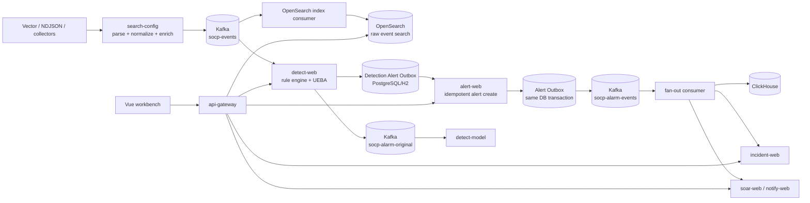

# SOCP SIEM Architecture

This document describes the implemented event pipeline, storage boundaries,
delivery semantics, and local deployment limits. Source code, migrations, and
the executable verification scripts remain the final source of truth.

## Event pipeline

`search-config` is the normalization boundary. It converts vendor-specific
input into a canonical event before publishing to `socp-events`. Detection and
indexing consume the same stream independently, so search indexing does not
block detection and a Detection restart can process Kafka backlog.

Detection does not call Alert Web directly from the rule-engine worker. It
materializes the alert payload and source identity in
`t_detection_alert_outbox`. The scheduled publisher retries the HTTP hand-off
with exponential backoff and carries the persisted tenant. Once Alert Web
acknowledges the request, the publisher sends the optional
`socp-alarm-original` event for `detect-model`. Alert Web then writes its own
transactional Outbox row and fans out to incident, notification, SOAR, and
analytics consumers.

## Responsibilities and storage

| Concern | Implementation | Boundary |
|---|---|---|
| Ingestion and parsing | Vector, collectors, `search-config` | Vendor formats stay outside detection rules |
| Event transport | Kafka `socp-events`, rule-change, alarm topics | Separates ingestion, detection, indexing, and fan-out |
| Detection | `socp-rule` embedded in `detect-web` | Rules, hot reload, suppression, windows, backpressure |
| Detection recovery | `t_detection_event` | Event claim, partition ownership, bounded state replay |
| Detection alert hand-off | `t_detection_alert_outbox` | Durable Alert Web delivery and retry |
| Alert facts | `alert-web` and PostgreSQL | Transactional lifecycle and tenant-scoped queries |
| Alert fan-out | `outbox_event` in `alert-web` | At-least-once downstream delivery |
| Event investigation | OpenSearch index consumer and search API | Full-text/field search stays separate from OLTP |
| Reporting | ClickHouse alarm consumer and `report-web` | Aggregation does not compete with alert writes |
| Response | `incident-web`, `notify-web`, `soar-web`, optional Temporal | Workflow state and compensation |

The default development setup uses PostgreSQL for alert, incident, SOC base,
and threat-intelligence data. Nine lower-resource stateful services use
file-backed H2 by default and provide an `application-pg.yml` profile.

## Reliability semantics

- Producers use `acks=all` and idempotence where configured.
- Kafka consumers use manual offset commits, stable event IDs, database-backed
  claims, and DLQ paths.
- Detection has a bounded queue. Queue rejection returns `503` with
  `Retry-After` at the HTTP boundary so collectors can retry.
- Detection persists a deterministic alert before remote delivery. A failed
  Alert Web request remains `PENDING`; a publisher crash recovers stale claims.
- Alert Web uses `(tenant_id, source_alert_id)` idempotency, so replaying a
  Detection Outbox row returns the existing alert instead of creating another.
- Alert Web writes its alert row and downstream Outbox row in one transaction.
- Kafka and downstream delivery are at-least-once. Consumers must remain
  idempotent; the system does not claim distributed exactly-once processing.
- Temporal is optional for development. SOAR can use the local executor when
  Temporal is unavailable; the `prod` guard rejects that fallback.

## Security and observability

`socp-auth` validates HMAC or JWKS JWTs, extracts the tenant claim, and applies
method-level `@RequireRole` checks. Tenant isolation is logical: services use
`tenant_id` and shared context/query filters rather than separate databases.

OpenTelemetry propagates trace context across HTTP requests and Kafka headers.
Audit records, trace IDs, health endpoints, Kafka lag, JVM metrics, and
outbox retry logs provide operational evidence for the event path.

## Runtime configuration

- Startup scripts use the `dev` profile for disposable local credentials.
- Services with `application-pg.yml` can switch from file-backed H2 to
  PostgreSQL with the `pg` profile.
- `prod` enables `ProdGuard`, which rejects H2, demo credentials,
  authentication bypass, the default ingest token, and disabled Temporal.
- Docker Compose is a single-node development/verification environment and is
  not a production HA deployment.
- `SOCP_KAFKA_GROUP_ID` overrides the Detection consumer group when launching
  multiple instances; all instances that share state must use the same
  PostgreSQL database and group.

## Known scaling boundaries

Detection keeps hot rule windows in process, while accepted events and event
claims are persisted in `t_detection_event`. The producer routes by the stable
`tenant_id | detection_routing_field | detection_routing_value` key, and a
consumer restores only journal rows for its assigned partitions.

A stateful rule is strictly partition-local only when its `keyField` matches
the event routing field. A rule grouped by another entity dimension requires a
shared state or fan-out design and is explicitly outside the strict guarantee.
Journal replay is bounded to the configured retention and read in pages; the
implementation does not silently truncate at a fixed row count. Kafka,
OpenSearch, PostgreSQL, and ClickHouse are single-node dependencies in the
local verification environment. See
[`detection-state-semantics.md`](detection-state-semantics.md) for the exact
contract and non-guarantees.

See [module-map.md](module-map.md), [getting-started.md](getting-started.md),
[testing.md](testing.md), and the [ADRs](adr/) for operational details.
