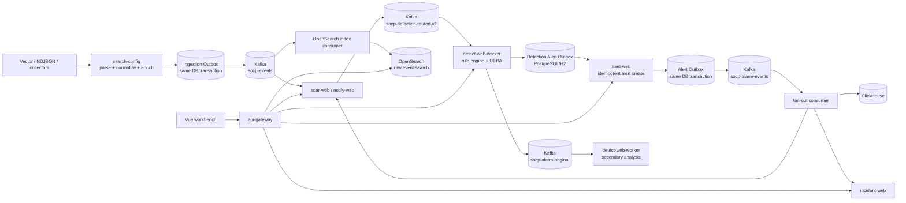

# SOCP SIEM Architecture

This document describes the implemented event pipeline, storage boundaries,
delivery semantics, and local deployment limits. Source code, migrations, and
the executable verification scripts remain the final source of truth.

## Event pipeline

`search-config` is the normalization boundary. It converts vendor-specific
input into a canonical event and writes the local event plus an Ingestion
Outbox row in one transaction. The publisher waits for Kafka acknowledgement
before marking that row published. Indexing consumes the canonical stream;
the Detection router durably fans each source event out once per required
state dimension before workers evaluate the routed stream. Search indexing
and Detection recover their Kafka backlogs independently.

Source-bound parsing, the supported filter subset, and the exact Vector
envelope are documented in [ingestion parsing](ingestion-parsing.md).

Detection does not call Alert Web directly from the rule-engine worker. It
materializes the alert payload and source identity in
`t_detection_alert_outbox`. The scheduled publisher retries the HTTP hand-off
with exponential backoff and carries the persisted tenant. Once Alert Web
acknowledges the request, the publisher sends the optional
`socp-alarm-original` event for the secondary analyzer hosted by
`detect-web-worker`. The analyzer retains the former `detect_model` database,
Flyway history, consumer group, and transaction boundary. Alert Web then
writes its own transactional Outbox row and fans out to incident,
notification, SOAR, and analytics consumers.

## Responsibilities and storage

| Concern | Implementation | Boundary |
|---|---|---|
| Ingestion and parsing | Vector, collectors, `search-config` | Vendor formats stay outside detection rules |
| Ingestion publication | `t_ingestion_outbox` | Event persistence and Kafka publication intent commit atomically |
| Event transport | Kafka `socp-events`, `socp-detection-routed-v2`, rule-change, and alarm topics | Separates canonical ingestion, dimension routing, detection, indexing, and downstream fan-out |
| Detection routing | `t_detection_route_source` and routing outbox | Durable, bounded fan-out once per required state dimension |
| Detection | `socp-rule` and the secondary analyzer embedded in `detect-web-worker` (`detect-web-api` owns management) | Rules, hot reload, suppression, windows, backpressure; secondary analysis uses its own persistence unit |
| Detection recovery | `t_detection_event` | Event lifecycle, partition ownership, time-bounded paginated replay |
| Detection alert hand-off | `t_detection_alert_outbox` | Durable Alert Web delivery and retry |
| Entity risk | `t_entity_risk_profile`, `t_entity_risk_alert` | Shared, idempotent projection across Detection instances |
| Alert facts | `alert-web` and PostgreSQL | Transactional lifecycle and tenant-scoped queries |
| Alert fan-out | `outbox_event` in `alert-web` | At-least-once downstream delivery |
| Event investigation | OpenSearch index consumer and search API | Full-text/field search stays separate from OLTP |
| Reporting | ClickHouse alarm consumer and `report-web` | Aggregation does not compete with alert writes |
| Response | `incident-web`, `notify-web`, `soar-web`, optional Temporal | Workflow state and compensation |

The startup scripts default to `dev,pg`. Every service that ships an
`application-pg.yml` overlay therefore uses PostgreSQL; stateless services and
adapters without that overlay keep their own non-relational dependencies. Set
`SOCP_RUNTIME_PROFILES=dev` for the intentional file-backed H2 fallback where
the service supports it.

## Reliability semantics

- Producers use `acks=all` and idempotence where configured.
- Canonical ingestion returns only after the event and Ingestion Outbox intent
  commit together; broker outages leave retryable `PENDING` rows.
- The OpenSearch consumer commits each partition only after its complete bulk
  succeeds. Failed partitions seek back, and stable event IDs make replay an
  idempotent document overwrite.
- Kafka consumers use manual offset commits, stable event IDs, database-backed
  claims, and DLQ paths.
- Detection has a bounded queue. Queue rejection returns `503` with
  `Retry-After` at the HTTP boundary so collectors can retry.
- Detection persists a deterministic alert before remote delivery. A failed
  Alert Web request remains `PENDING`; a publisher crash recovers stale claims.
- Alert Web uses `(tenant_id, source_alert_id)` idempotency, so replaying a
  Detection Outbox row returns the existing alert instead of creating another.
- Alert Web writes its alert row and downstream Outbox row in one transaction.
- Alert creation atomically records the Kafka Outbox row and one durable,
  idempotent delivery intent for each ClickHouse/Incident/Notify/SOAR target.
  Delivery workers use database claims, bounded retries, and stale-claim
  recovery; Kafka replay reconciles any missing intents.
- Kafka and downstream delivery are at-least-once. Consumers must remain
  idempotent; the system does not claim distributed exactly-once processing.
- Temporal is optional for development. SOAR can use the local executor when
  Temporal is unavailable; the `prod` guard rejects that fallback.
- The fallback SOAR scheduler enumerates enabled playbooks by tenant, evaluates
  times in `SOCP_SOAR_SCHEDULE_ZONE`, and claims
  `(tenant_id, playbook_id, scheduled_for)` in PostgreSQL/H2 before executing.
  Multiple SOAR instances therefore cannot fire the same scheduled side effect
  twice for one minute.
- Secondary analysis claims `(tenant_id, source_alarm_id, analyzer_version)` in
  `t_analysis_receipt` in the same transaction as its result. Kafka redelivery
  is therefore a state-preserving no-op after a committed analysis, while a
  rolled-back attempt remains retryable.

## Security and observability

`socp-auth` validates HMAC or JWKS JWTs, extracts the tenant claim, and applies
method-level `@RequireRole` checks. Side-effecting internal endpoints can also
require a signed `ServiceRequestSignature`; the endpoint then rejects a user
JWT even when the caller has an otherwise valid role. Tenant isolation uses
three layers: `TenantScopedRepository` exposes explicit tenant predicates,
`TenantEntityWriteGuard` rejects cross-tenant writes, and PostgreSQL RLS can
enforce the same boundary at the connection/database layer. Scheduled jobs
must enter the explicit system scope; missing request scope fails closed.

The canonical `search-config /api/v1/ingest` boundary requires an authenticated
collector identity or a signed internal service request. Collector credentials
are configured as `collector-id|tenant-id|secret` entries in
`SOCP_COLLECTOR_CREDENTIALS`; the bound tenant is taken from the credential, not
from the request body or `X-Tenant-Id`. A legacy single ingest token remains a
development-only compatibility path and is disabled by setting
`SOCP_ALLOW_GLOBAL_INGEST_TOKEN=false`. Body fields such as `collector` are
treated as metadata only and cannot relabel an authenticated source.

OpenSearch uses the JVM trust store by default. A deployment may provide an
explicit `socp.opensearch.tls.trust-store`; the local
`socp.opensearch.tls.insecure-skip-verify` escape hatch is rejected by
`ProdGuard`. Production startup also fails on known development credentials,
authentication bypass, untrusted HTTP endpoints, shared in-memory rate limits,
or a non-fail-closed Redis rate-limit backend.

OpenTelemetry propagates trace context across HTTP requests and Kafka headers.
Audit records, trace IDs, health endpoints, Kafka lag, JVM metrics, and
outbox retry logs provide operational evidence for the event path.

## Runtime configuration

- Startup scripts use `dev,pg` by default so local verification matches the
  Docker PostgreSQL middleware; set `SOCP_RUNTIME_PROFILES=dev` for the
  intentional lightweight H2 fallback.
- Services with `application-pg.yml` switch from file-backed H2 to PostgreSQL
  when the `pg` profile is present.
- Stateful rule windows are bounded by `SOCP_RULE_STATE_MAX_KEYS` and
  `SOCP_RULE_STATE_IDLE_TTL_MS`; eviction counts are exposed in rule stats.
- `prod` enables `ProdGuard`, which rejects H2, demo credentials,
  authentication bypass, default ingest/Vector/OpenSearch credentials,
  trust-all or HTTP OpenSearch, a global collector token on `search-config`,
  and disabled Temporal. Redis-backed rate limiting must be fail-closed.
- Docker Compose is a single-node development/verification environment and is
  not a production HA deployment.
- `SOCP_KAFKA_GROUP_ID` overrides the Detection consumer group when launching
  multiple instances; all instances that share state must use the same
  PostgreSQL database and group.
- Servlet services use the explicit `socp-starter` integration and expose
  generated OpenAPI at `/v3/api-docs`; the API versioning and compatibility
  policy is recorded in [API contract](api-contract.md).
- Application image/Kubernetes and backup baselines live in
  [production-readiness](production-readiness.md); they are release contracts,
  not evidence that this repository operates a production cluster.

## Known scaling boundaries

Detection keeps hot rule windows in process, while canonical source receipts,
routing intents, and routed event claims are durable. Routed deliveries use
the stable `tenant_id | grouping_dimension | grouping_value` key, and a
consumer restores only journal rows for its assigned routed partitions.

Entity risk is not instance-local hot state. Deterministic alert IDs feed a
shared risk-event table and a locked profile projection, so a rebalance does
not change the served risk value.

A stateful rule must use the same dimension for `groupBy`, `keyField`, and
`routingField`. The routed-v2 plan fans a source event out once per unique
dimension required by active rules; unsupported dimensions or missing values
fail closed or are recorded explicitly. Legacy canonical-topic mode is a
migration/rollback path and reports `LEGACY_PARTIAL` for cross-dimension state.
The first routed event pins a tenant's dimension/source topology. Rule writes
and that first pin share a database mutex; once pinned, changes that would alter
the topology return HTTP 409 before updating the rule or its revision history.
Content tuning that preserves the topology remains available. A new dimension
or source requires a new routing version and delivery topic with prewarm/cutover;
changing only the topic or removing the pin is not a supported migration.
Routing health and the routing-plan API expose persisted topology conflicts.
The mutex row uses `plan_version=unbound` until the first pin, so initial rule
configuration is possible before any routed event has been materialized.

External log/HTTP input cannot supply `detection_*`, `routing_field`, or
`routing_value` control metadata. Input values are retained under `user_payload.`
(repeated when necessary to preserve a colliding evidence field). Ingestion
timestamps are assigned at the trusted ingress. Routed consumers require a
consistent versioned delivery envelope and identity before evaluating rules.
Kafka completion advances across offsets actually delivered by the broker;
transaction markers and aborted records do not create artificial pending work.

AI investigation submission persists a queryable `NEW` receipt before returning.
A scheduled dispatcher scans durable queued or expired work, with
`socp.ai.investigation.async-workers` concurrent workers (default 2, maximum 16)
and no in-memory waiting queue. Each attempt uses a distinct claim token.
`PARTIAL` and `COMPLETED` results are terminal; failed tasks are retried by an
explicit resubmission. Browser polling may be cancelled without deleting the
durable task. Persistent queue age and target deployment capacity remain release
acceptance concerns.

Journal replay is bounded to the configured retention and read in pages; the
implementation does not silently truncate at a fixed row count. Kafka,
OpenSearch, PostgreSQL, and ClickHouse are single-node dependencies in the
local verification environment. See
[`detection-state-semantics.md`](detection-state-semantics.md) for the exact
contract and non-guarantees.

See [module-map.md](module-map.md), [getting-started.md](getting-started.md),
[testing.md](testing.md), and the [ADRs](adr/) for operational details.
