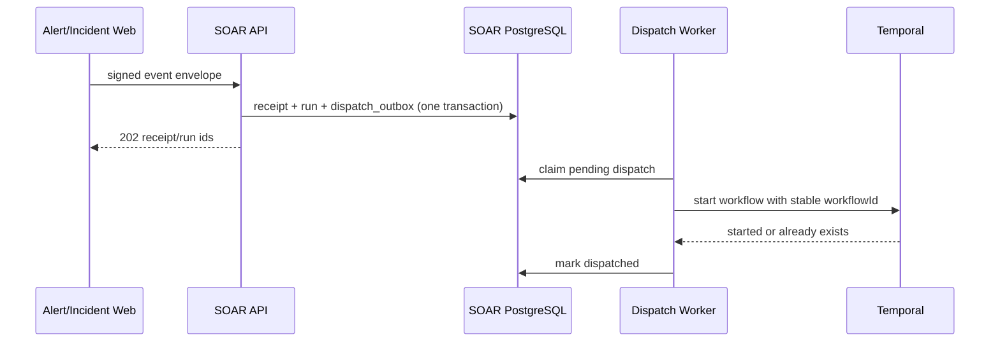
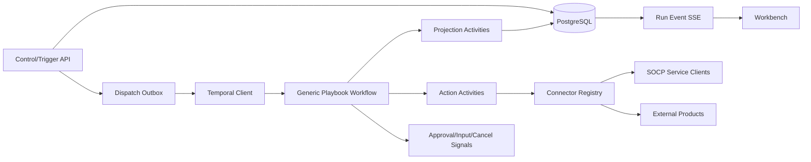

# SOAR 架构与运行契约

适用范围：`services/soar-web`、`frontend/apps/workbench`，以及与 Alert、
Incident、Search、Asset、HIPS、Threat 和 Notify 的集成。

## 1. 结论

`soar-web` 实现版本化图剧本、持久运行投影、Temporal 工作流、审批和
人工任务、连接器控制面、自动化规则及可视化工作台。真实厂商连接器、
目标环境容量、HA、密钥轮换和运维 SLO 仍需部署侧验收。

系统基于 Java 21/Spring Boot、Vue 3、PostgreSQL、Temporal 和统一认证体系，
提供以下能力：

- 可视化、可版本化、可发布和可回滚的剧本；
- Alert、Incident、Entity、Schedule、Webhook 和 Manual 六类触发；
- 条件、分支、并行、汇聚、有界循环、延迟、子剧本、审批和人工任务；
- 类型化数据映射、安全表达式和可追踪的节点输入输出；
- 连接定义、连接实例、密钥引用、连通性测试和动作目录；
- 真正异步、崩溃可恢复、逐节点持久化的执行引擎；
- 高风险动作的职责分离、目标范围限制、回执校验和不确定结果处置；
- 完整的运行详情、审计、指标、日志、链路和失败恢复入口；
- 与告警、案件、资产、检索、威胁情报、终端和通知模块形成闭环。

这些能力不代表第三方厂商认证、生产 HA 或无限连接器生态。

## 2. 实现与准入边界

### 2.1 仓库实现

仓库实现包含：

- Playbook/Version 草稿、校验、发布、弃用、回滚和不可变版本；
- 图节点、分支、并行、汇聚、审批、人工任务、子剧本与有界执行预算；
- Run/Node/Attempt/Event/Artifact 持久投影，以及取消、重试、重跑和未知结果处置；
- PostgreSQL claim、幂等 receipt、dispatch 恢复和多实例准入边界；
- Temporal Workflow/Activity 执行，生产 profile 禁止非持久副作用回退；
- Automation Rule、定时触发、告警事件触发和循环防护；
- Connector/Connection/Action Catalog、密钥引用、目标限制、回执和 SSRF 防护；
- Playbook 编辑器、运行检查器、审批/人工任务和连接管理工作台；
- OpenAPI、租户隔离、细粒度权限、审计、指标和 live/multi-instance 验证。

### 2.2 部署侧验收

| 领域 | 仓库内证据 | 尚需关闭的边界 |
|---|---|---|
| 外部连接器 | reference adapter、回执、幂等、SSRF 和审批测试 | 每个真实厂商 sandbox、权限、限流、超时和撤销能力验收 |
| 生产运行 | PostgreSQL/Temporal live、多实例 fence、恢复与 retention 测试 | 目标集群 HA、容量、备份恢复、升级窗口和 SLO 演练 |
| 密钥治理 | secret reference、redaction、禁止定义内明文 | 部署平台 KMS/Vault、轮换、审计和应急吊销流程 |
| 历史兼容 | 版本化 definition、迁移和 replay 测试 | 长期运行的真实 Temporal History 与历史租户数据升级验收 |
| 产品验收 | 工作台、OpenAPI 和五类黄金场景 | 目标 SOC 的角色矩阵、审批策略、内容包和操作流程签收 |

### 2.3 不变量

实现变更必须保留以下约束：

1. 所有读写按 `TenantContext` 隔离，Repository 查询必须显式带 `tenant_id`，生产 PostgreSQL 保留 RLS 防线。
2. 内部触发入口继续使用服务身份，不能用普通用户 JWT 冒充 Alert Web。
3. 现有 `(tenant_id, alarm_id)` 告警评估去重和 `(tenant_id, playbook_id, scheduled_for)` 调度 claim 的意图必须迁移到新 receipt 模型。
4. 外部动作继续携带稳定幂等键；高风险动作必须验证业务回执，HTTP 2xx 本身不是完成证明。
5. `prod` 禁止 simulation、默认密钥、HTTP/不可信 TLS 和非持久执行回退。
6. OpenTelemetry trace、`ApiResult`、OpenAPI、统一异常和 `socp-audit` 必须接入，而不是另建一套横切框架。
7. 所有 Playbook、Run 和事件调用统一进入 `/api` 控制面，不维护第二套 SOAR HTTP 入口。

## 3. 目标与非目标

### 3.1 运行目标

1. 分析员能在 UI 中从模板创建剧本，配置输入、条件和动作，测试后提交发布。
2. 发布者能看到确定性的校验结果和风险摘要；已发布定义不可原地修改。
3. 告警或案件事件被系统接受后，即使 SOAR/Temporal Worker 重启也不会丢失。
4. 一个运行可以等待数小时的审批或人工输入，而不占用 HTTP 请求或 JVM 线程。
5. 分析员能看到每个节点何时开始、用了什么非敏感输入、调用哪个连接、返回何种回执、为什么失败以及下一步怎么处理。
6. 高风险动作默认不能自动执行，审批人不能审批自己发起的请求。
7. 连接密钥不进入剧本定义、Temporal History、数据库结果、API 响应、日志或审计详情。
8. 告警调查可以完成“富化 → 判断 → 建案/更新案件 → 通知 → 经审批遏制 → 验证 → 留痕”的闭环。

### 3.2 非目标

- 不执行用户提交的 JavaScript、Python、Shell 或 SpEL。
- 不动态加载任意 JAR/ZIP 插件；连接器随受控构建发布。
- 不替代 `incident-web` 的案件管理，也不复制 `search-config` 的搜索存储。
- 不承诺没有幂等或查询能力的第三方系统实现 exactly-once 副作用。
- 不提供跨地域 active-active Temporal/PostgreSQL。
- H2、内存队列和模拟连接器不构成生产就绪证据。
- AI 生成的草稿或参数建议不能绕过验证、发布和审批流程。

## 4. 核心领域模型

### 4.1 术语

| 术语 | 定义 |
|---|---|
| Playbook | 稳定身份和元数据容器，本身不包含可变的线上逻辑 |
| Playbook Version | 某次不可变工作流定义；草稿可编辑，发布后冻结 |
| Automation Rule | 事件触发、条件、优先级、抑制和目标剧本版本的绑定 |
| Connector | 一类产品或平台集成，发布一组 Action Definition |
| Connection | 某租户对 Connector 的一个配置实例，类似 SOAR asset |
| Action Definition | 动作 ID、输入/输出 schema、风险、幂等、超时和权限元数据 |
| Run | 一次剧本执行，固定引用一个已发布版本及输入快照 |
| Node Run | 某节点在某次 Run、某个循环迭代中的状态投影 |
| Attempt | 一次真实外部调用尝试及其回执 |
| Approval Task | 执行危险节点前的审批闸门 |
| Manual Task | 需要分析员提供结构化输入或完成线下步骤的任务 |
| Trigger Receipt | 对一个来源事件和自动化规则的幂等处理凭证 |

### 4.2 生命周期

Playbook 元数据状态：

```text
ACTIVE -> ARCHIVED
ARCHIVED -> ACTIVE
```

Playbook Version 状态：

```text
DRAFT -> PUBLISHED -> DEPRECATED
  |          |
  +-> DELETED (仅未被引用草稿)
             +-> CLONED_AS_NEW_DRAFT
```

约束：

- `PUBLISHED` 不可修改，只能克隆成新草稿；
- Automation Rule 只能引用 `PUBLISHED` 版本；
- `DEPRECATED` 允许已有运行完成，但不能新绑定；
- Playbook 被 archive 时暂停其 Automation Rule，不删除历史；
- 同一 Playbook 同时最多一个可编辑草稿，使用乐观锁防覆盖。

Run 状态：

```text
QUEUED -> DISPATCHING -> RUNNING
RUNNING -> WAITING_APPROVAL -> RUNNING
RUNNING -> WAITING_INPUT    -> RUNNING
RUNNING -> CANCELLING -> CANCELLED
RUNNING -> SUCCEEDED | PARTIALLY_SUCCEEDED | FAILED | TIMED_OUT | ACTION_UNKNOWN
QUEUED/DISPATCHING -> FAILED | CANCELLED
```

`ACTION_UNKNOWN` 表示请求可能已经到达外部系统，但本地未取得可信回执。它不是 `FAILED`，不得自动重试不可逆动作。

Node Run 状态：

```text
PENDING -> READY -> RUNNING
RUNNING -> WAITING_APPROVAL | WAITING_INPUT
RUNNING -> SUCCEEDED | FAILED | SKIPPED | TIMED_OUT | ACTION_UNKNOWN
WAITING_* -> RUNNING | FAILED | SKIPPED
任意非终态 -> CANCELLED
SUCCEEDED -> COMPENSATING -> COMPENSATED | COMPENSATION_FAILED
```

## 5. 剧本定义

### 5.1 内部格式

内部格式使用版本化 JSON，而不是把 UI 布局当执行定义。发布时保存：

- `definition_json`：运行语义；
- `layout_json`：画布坐标、折叠和注释，只供 UI；
- `definition_hash`：规范化 JSON 的 SHA-256；
- `schema_version`：固定为 `soar.playbook`；
- 编译产物中的动作目录版本、风险摘要和静态引用。

最小示例（校验、重试和风险策略字段从略）：

```json
{
  "schemaVersion": "soar.playbook",
  "entryNodeId": "start",
  "nodes": [
    { "id": "start", "type": "START" },
    {
      "id": "lookup",
      "type": "ACTION",
      "actionRef": "socp.threat-intel/ioc.lookup@1",
      "parameters": { "value": { "$expr": "trigger.data.entity.value" } }
    },
    { "id": "end", "type": "END", "outcome": "SUCCEEDED" }
  ],
  "edges": [
    { "from": "start", "to": "lookup" },
    { "from": "lookup", "to": "end" }
  ]
}
```

文本模板中的 `${...}` 只允许引用已编译的数据路径，不能执行表达式；计算必须显式使用 `$expr`。

### 5.2 节点类型

| 节点 | 用途 | 必要语义 |
|---|---|---|
| START | 唯一入口 | 恰好一个，无入边 |
| END | 分支或流程终点 | 至少一个，无出边，声明 outcome |
| ACTION | 调用目录中的动作 | schema 校验、超时、重试、回执、错误策略 |
| CONDITION | true/false 分支 | CEL 返回 boolean，两个端口完整 |
| SWITCH | 多值分支 | case 顺序明确，必须有 default |
| PARALLEL | 启动多个分支 | 受 `maxParallelism` 限制 |
| JOIN | 汇聚并行分支 | `ALL_SUCCESS`、`ALL_DONE`、`ANY_SUCCESS` |
| FOREACH | 遍历数组 | 最大 100 项；并发 1~10；每项独立 iteration |
| DELAY | 等待一段时间或时间点 | 使用 Temporal Timer，不阻塞线程 |
| APPROVAL | 等待批准/拒绝/过期 | Signal 驱动，支持策略分支 |
| MANUAL_TASK | 结构化人工输入 | 表单 JSON Schema、负责人、到期时间 |
| SUB_PLAYBOOK | 调用已发布子剧本 | Child Workflow；发布时固定版本 |
| SET_VARIABLE | 构造非敏感变量 | 只能写 `vars.*`，输出经 schema 限制 |

不允许任意回边。循环只能通过有项目数、并发和总超时限制的结构化
`FOREACH` 表达。

### 5.3 表达式与数据上下文

采用 CEL 作为条件和计算表达式。原因是它可预编译、可类型检查、非通用脚本语言，适合处理不可信安全事件。严禁用 SpEL 或脚本引擎解释用户内容。

上下文命名空间固定为：

| 命名空间 | 内容 | 可写性 |
|---|---|---|
| `trigger` | 触发事件不可变快照 | 只读 |
| `run` | runId、时间、发起者、触发类型 | 只读 |
| `vars` | 剧本声明的工作变量 | `SET_VARIABLE` 可写 |
| `nodes.<nodeId>.output` | 已完成节点的脱敏输出 | 只读 |
| `iteration` | foreach 的 index/item | 只读、仅循环体 |
| `case`、`alert` | 可选的规范化业务对象 | 只读；修改必须走 Action |

不存在可被剧本读取的 `secrets` 命名空间。密钥只在 Action Activity 内按引用解析。

表达式限制：长度 4 KiB、编译 100 ms、执行 50 ms、最大嵌套 20、集合最大 1,000 项；不开放反射、文件、网络、当前时间或随机函数。所有表达式在发布前编译，在运行时只执行编译结果对应的规范化表达式。

### 5.4 发布前静态校验

发布接口必须一次返回全部 `errors[]` 和 `warnings[]`，每项包含 `code`、`nodeId`、`path`、`message`。至少校验：

1. schema 版本、定义大小（最大 256 KiB）和节点数（最大 200）；
2. node ID 唯一且符合 `[a-zA-Z][a-zA-Z0-9_-]{0,63}`；
3. 唯一 START、至少一个 END、端口合法、所有节点可达；
4. 除结构化循环外无环，PARALLEL/JOIN 成对且不会永久等待；
5. `actionRef` 存在、版本可用，参数与输出映射符合 JSON Schema；
6. `connectionRef` 属于当前租户且连接器类型匹配；
7. 数据引用只指向必然先完成的节点；并行分支不能读取未 join 的结果；
8. 子剧本存在、已发布且调用图无递归；最大深度 5；
9. foreach、并发、节点数、超时和数据大小有界；
10. 高风险动作前存在满足策略的审批节点；补偿动作同样经过策略；
11. 所有失败、拒绝、过期和 default 路径有确定终点；
12. 未出现 secret 值、内嵌凭据 URL、明文 token 或被禁地址。

校验通过不代表连接可用；发布结果需同时显示连接健康状态和最后测试时间。

### 5.5 模板与内容包

仓库交付第 16.1 节的五个黄金场景模板。模板以版本化 JSON 资源保存；
每个模板包含说明、适用事件类型、所需连接器、预期输入、风险、ATT&CK
标签和测试样例。安装模板只创建租户草稿，不自动发布、启用规则或执行动作。

内部 JSON 导入必须经过与 UI 发布相同的 schema、引用、风险和权限校验，
不能成为绕过入口。不支持的外部格式必须拒绝，不能近似转换后自动发布。

## 6. 自动化规则与触发

### 6.1 事件信封

SOAR 不再为每种来源接受任意 Map。所有自动触发先规范化为：

```json
{
  "schemaVersion": "soar.event",
  "eventId": "alert:uuid:created:1",
  "eventType": "alert.created",
  "tenantId": "tenant-a",
  "occurredAt": "2026-09-03T08:00:00Z",
  "producer": "alert-web",
  "subject": { "type": "alert", "id": "uuid" },
  "data": {
    "alert": {},
    "entities": [],
    "evidence": []
  },
  "trace": {
    "traceparent": "...",
    "correlationId": "...",
    "causationId": "...",
    "automationDepth": 0
  }
}
```

事件类型：

- `alert.created`、`alert.updated`；
- `incident.created`、`incident.updated`；
- `entity.selected`；
- `schedule.fired`；
- `webhook.received`；
- `manual.requested`。

`webhook.received` 必须绑定启用的 Webhook Connection，使用 HMAC/非对称签名和时间戳防重放，并以 `(tenant_id, connection_id, external_event_id)` 去重；租户不能由 body 或普通 `X-Tenant-Id` 自报。`entity.selected` 是经过用户鉴权的手工入口，主体类型至少支持 IP、domain、URL、file hash、user、host 和 endpoint。

Alert 入口保留 `riskScore`、`riskLevel`、`triggerEventId` 和 `evidence`。
Incident Web 不发布案件 created/updated 事件，因此案件变更不是自动触发来源。

### 6.2 Automation Rule

规则包含：

- `eventType`；
- CEL `condition`；
- `priority`，数字小的先评估；
- 固定的 `playbookVersionId`；
- `enabled` 和生效时间窗；
- `dedupWindow`、`cooldown`；
- `groupBy` 表达式；
- `maxConcurrentRuns`；
- 冲突策略 `QUEUE` 或 `SUPPRESS`；
- 可选标签、描述和 owner。

一个事件可命中多个规则。评估顺序稳定为 `(priority, rule_id)`；每条命中独立产生 Run。规则之间不共享可变上下文。

### 6.3 幂等、抑制和回环防护

- Trigger Receipt 唯一键为 `(tenant_id, event_id, automation_rule_id, rule_revision)`；
- Run 的 Workflow ID 固定为 `soar/{tenantHash}/{runId}`；重复 start 视为对同一运行的确认；
- Action 幂等键固定为 `sha256(tenantId, executionSeriesId, nodeId, iterationPath, logicalTarget)`，同一逻辑重试保持不变；
- 自动化产生的新事件必须携带 `causationId` 和 `automationDepth + 1`；默认不匹配由同一 Run 产生的相同事件；
- `automationDepth > 5` 直接抑制并审计；
- cooldown/groupBy 命中时创建 `SUPPRESSED` receipt，而不是静默丢弃；
- `QUEUE` 有租户和连接两层上限，不能无限堆积。

### 6.4 接收与调度一致性

接收路径采用本地事务 + Outbox：



只要 API 返回 `202`，receipt、run 和 dispatch intent 就必须已经提交。Temporal 暂时不可用时保留 `QUEUED` 并重试，不得改走进程内执行器。超过重试预算进入 `DEAD`，在运维 API 和指标中可见，可人工 requeue/discard；discard 必须填写原因。

## 7. 执行引擎

### 7.1 总体架构

SOAR 保持为 `soar-web` 部署单元，并在代码内分层：



源码按 `api`、`connector`、`definition`、`domain`、`persistence`、`service` 和
`temporal` 等包分层。控制面 Run 由 `SoarDispatchWorker` 通过
`SoarWorkflowImpl` 执行 durable graph；`PlaybookWorkflowImpl` 与
`PlaybookExecutor` 保留既有告警评估和定时任务的线性兼容路径。两条 Worker
均被注册，新图定义不得回退到线性路径。

### 7.2 Temporal 运行契约

1. API 使用 `WorkflowClient.start(...)` 异步启动，禁止同步 `stub.executePlaybook(...)`。
2. Workflow 输入只包含不可变定义快照、非敏感触发快照和 ID；总大小上限 512 KiB。
3. Workflow 代码只做确定性图推进，不访问数据库、网络、系统时钟、随机数或 Spring Bean；所有 I/O 是 Activity。
4. 审批、人工输入和取消使用 Signal；查询主要读 PostgreSQL 投影，不让 UI 依赖 Temporal 可用性。
5. 每个 Action 是独立 Activity；Projection 更新可重试且幂等。
6. Delay 使用 Temporal Timer，Sub-playbook 使用 Child Workflow。
7. 长循环每 250 个节点或 History 达到内部阈值时 Continue-As-New，并携带最小状态。
8. Activity 必须配置 Start-to-Close、Schedule-to-Close、Heartbeat（长动作）和显式 Retry Policy。
9. Workflow/Activity DTO 只做加字段兼容；破坏性变更使用新 Workflow type/task queue 或 Temporal Worker Deployment 版本策略。
10. 生产 Temporal 不可用时 health 为 `DEGRADED`、执行排队；不能伪装成功或内存降级。

Action Activity 的持久化边界固定为三个阶段：先用短事务登记
`RUNNING` attempt（并锁定/复用同一业务键），再在事务外调用连接器、reconcile
和对象存储，最后用新的短事务写入 attempt、node projection 与事件。补偿调用
也遵循“事务外远端调用、短事务写事件”的顺序；数据库事务不得跨越供应商网络
或对象存储 I/O。若 Worker 在登记后、取得可信回执前退出，恢复器只把仍有
`RUNNING` attempt 的 Run 标记为 `ACTION_UNKNOWN`；没有进行中动作而仅投影落后
的 Run 标记为 `FAILED/SOAR_PROJECTION_STALE`，避免把未执行动作误导为需要重放。

### 7.3 图执行语义

- START 产生一个 token；普通节点完成后按端口把 token 发送到后继节点；
- CONDITION/SWITCH 每次只选择一个输出端口；
- PARALLEL 为每个分支产生 token；JOIN 按固定策略收敛；
- `ALL_SUCCESS` 遇到失败按 JOIN 的 `onError` 处理，`ALL_DONE` 输出各分支结果摘要；
- FOREACH 为每项建立 `iterationPath`，输出按原输入顺序聚合，不按完成顺序；
- 同一节点在同一 iteration 中最多执行一次，除非进入显式补偿；
- 节点输出不可覆盖；`vars` 更新由 Workflow 单线程确定性合并；
- 到达 END 后只有所有活动分支均终止，Run 才进入终态；
- 达到 `maxNodeExecutions`、总超时或取消请求时停止调度新节点。

### 7.4 错误、重试与不确定结果

每个动作声明：

- `sideEffect`: `NONE | REVERSIBLE | IRREVERSIBLE`；
- `idempotency`: `NATIVE | RECONCILABLE | NONE`；
- `riskLevel`: `READ_ONLY | LOW | MEDIUM | HIGH | CRITICAL`；
- 可重试错误码集合；
- 默认超时与最大尝试；
- 可选 `reconcile` 和 `compensate` 能力。

策略：

| 情况 | 行为 |
|---|---|
| 调用前校验失败 | `FAILED`，不重试 |
| 明确 4xx 业务拒绝 | `FAILED`，不重试 |
| 429/503/连接前失败且动作可幂等 | 指数退避 + jitter |
| 请求发出后超时，动作支持查询 | 先 `reconcile(idempotencyKey/operationId)`，再决定重试 |
| 请求发出后超时，动作不可查询且不可幂等 | `ACTION_UNKNOWN`，等待人工处置 |
| 取得 accepted 但异步未完成 | 按 operationId 轮询/回调，保持 RUNNING |
| 补偿失败 | `COMPENSATION_FAILED`，Run 为 `PARTIALLY_SUCCEEDED` 或 `FAILED` |

不得用 Temporal 默认无限 Activity 重试。通知、建案等可能重复的动作也必须依赖业务幂等 receipt，而不是假定 HTTP 客户端重试安全。

节点 `onError` 仅允许：

- `FAIL_RUN`；
- `CONTINUE`（发布时产生高可见 warning）；
- `GOTO_ERROR_PORT`；
- `COMPENSATE_THEN_FAIL`。

### 7.5 手工 retry 与 rerun

- `retry`：创建新 Run，但沿用 `executionSeriesId` 和已确认动作的幂等键，只从安全检查通过的失败节点继续；原 Run 永不改写。
- `rerun`：全新 `executionSeriesId`，表示用户明确要求再次产生副作用；UI 必须展示风险摘要并二次确认。
- `ACTION_UNKNOWN` 只能先由具备权限的操作员标记 `CONFIRMED_SUCCEEDED` 或 `CONFIRMED_NOT_EXECUTED`，附证据和原因，之后才能继续。

## 8. Connector SDK 与动作目录

### 8.1 分层模型

Connector Definition 是代码发布的能力描述；Connection 是租户配置；Action Definition 是可拖入剧本的强类型动作。剧本只能引用 `actionRef + connectionRef`，不允许把任意 URL、用户名或 token 写入动作字符串。

Connector SDK 最小契约：

```java
public interface SoarConnector {
    ConnectorDescriptor descriptor();
    ConnectionTestResult test(ConnectionContext connection);
    ActionResult execute(ActionRequest request);
    default Optional<ActionResult> reconcile(ActionQuery query) { return Optional.empty(); }
    default Optional<ActionResult> compensate(ActionRequest request) { return Optional.empty(); }
}
```

`ActionRequest` 包含 tenant、run/node/attempt ID、稳定幂等键、已通过 schema 校验的参数、目标快照和仅 Activity 内可见的 credential handle。`ActionResult` 必须包含标准状态、operationId/receipt、脱敏输出、可重试标志、错误码和远端时间；不得返回 credential。

#### 真实动作回执

连接器不能把 HTTP `2xx` 单独当作遏制或取证成功。HTTP adapter 的 JSON
响应必须提供 `operationId`，并明确包含 `accepted=true`、`verified=true`，
或状态 `accepted|executed|already_applied|success` 之一。请求携带稳定的
`idempotencyKey`、alarm context 和 `soarAction`；adapter 必须用幂等键去重
并为重试返回同一业务回执。

参考 endpoint/firewall adapter 使用
`SOCP_SOAR_FIREWALL_BLOCK_URL`、`SOCP_SOAR_NETWORK_ISOLATION_URL`、
`SOCP_SOAR_SNAPSHOT_URL` 和 `SOCP_SOAR_CONNECTOR_TIMEOUT_MS`。空 endpoint
返回 `CONNECTOR_NOT_CONFIGURED`。本地 dry-run 始终显式标记为
`simulate:<action>`/`simulated`，生产 profile 禁止 simulation。

### 8.2 Action Definition 元数据

每个动作必须声明：

- 稳定 ID 和 major version，例如 `endpoint/isolate-host@1`；
- 本地化名称、描述、分类和图标；
- input/output JSON Schema 和 UI hints；
- 是否需要 Connection、支持的连接器类型；
- sideEffect、riskLevel、idempotency 和审批默认值；
- 默认/最大超时、重试上限、并发和速率提示；
- 输出中的 sensitive 字段和最大 payload；
- 可用的 compensate/reconcile 动作；
- 所需平台权限和允许目标类型。

动作 schema 的 breaking change 必须升 major；已发布剧本继续解析旧 major，直到版本被明确下线。

### 8.3 动作目录

| Connector | 动作 | 备注 |
|---|---|---|
| `socp.alert` | get、add-note、assign、set-status、add-tag | 类型化 Alert client |
| `socp.incident` | get/create、append-timeline、assign、set-status、add-task/complete-task | 类型化 Incident client |
| `socp.search` | search-events、get-event | 只读，限制时间窗和返回条数 |
| `socp.asset` | find-by-entity、get-asset | 只读富化 |
| `socp.threat-intel` | lookup-ioc | 只读富化 |
| `socp.notify` | send-channel | 显式 channelId 和 delivery receipt |
| `http.webhook` | request | 仅管理员创建的 Connection，受出站策略约束 |
| `endpoint` | isolate-host、release-host、snapshot | 通过真实厂商适配器；未配置时明确不可用 |
| `firewall` | block-ioc、unblock-ioc | 通过真实厂商适配器；要求 operation receipt |

模拟 endpoint/firewall 行为不构成生产验收。WireMock/reference adapter 仅用于
测试，UI 必须显示 `TEST ONLY`。

### 8.4 Connection 与密钥

Connection 保存：名称、connectorId、非敏感 `config_json`、`secret_refs_json`、作用域、标签、状态、版本和最后测试结果。

密钥策略：

1. 数据库只存引用，例如 `env://SOCP_EDR_CLIENT_SECRET` 或 `k8s://namespace/secret/key`，不存值。
2. `SecretResolver` SPI 提供环境变量、Kubernetes projected-volume 和 Vault KV HTTP provider；provider 每次在 Activity lookup 时解析，不在 JVM 中缓存 secret value。
3. 解析只发生在 Action Activity 内；Workflow、API 和校验器只能看到引用和掩码。
4. test connection 也走审计、超时、出站策略和脱敏。
5. 运行记录保存 `connectionId + connectionRevision`，但密钥轮换无需重发剧本版本。
6. 删除 Connection 必须是软删除；被发布版本引用时拒绝删除。

### 8.5 通用 HTTP 安全策略

- endpoint 只能由 `soar:connections:manage` 权限配置，剧本作者不能覆盖 host/scheme/port；
- 只允许 HTTPS；开发 profile 可显式允许 loopback 测试；
- DNS 解析前后都执行 SSRF 校验，禁止 link-local、云 metadata、未授权私网和重绑定；
- 私有 SOCP 服务不走通用 HTTP，而走类型化 service client；
- 配置域名/网段 allowlist、允许 method、最大请求/响应 1 MiB、连接/读取超时；
- 禁止 URL 内嵌 credential，禁止任意 hop 转发平台 Authorization/Cookie；
- 默认不跟随重定向；如开启，每一跳重新校验；
- TLS 校验不可关闭，敏感 header 只从 secret resolver 注入且永不回显。

## 9. 风险与审批策略

### 9.1 默认策略

| 风险 | 示例 | 自动执行默认值 | 审批要求 |
|---|---|---|---|
| READ_ONLY | IOC/资产/事件查询 | 允许 | 无 |
| LOW | 添加 note/tag、创建人工任务 | 允许 | 无 |
| MEDIUM | 通知、建案、分派、改案件状态 | 租户管理员可配置 | 可选 |
| HIGH | 隔离/释放终端、封禁/解封 IOC、快照 | 禁止 | 1 名非发起人 |
| CRITICAL | 禁用账号、删除资源、大范围封禁 | 禁止 | 不支持自动执行 |

策略取 `max(action 默认风险, connection 风险, target 范围风险, tenant policy)`，剧本作者只能提高不能降低。批量目标超过阈值自动升级风险。

### 9.2 审批规则

- 审批绑定 `runId + nodeRunId + inputHash + targetSnapshot + expiresAt`；参数变化后旧审批失效；
- 发起者、最近一次编辑者不能审批自己的高风险动作；
- 只有策略指定角色/用户组可审批；
- `policy.allowedRoles` 与 `policy.allowedGroups`（也兼容 `approverRoles`/`approverGroups`）在发布时冻结到 `policy_json`；审批服务从当前认证主体的 authorities/常见 OIDC group claims 取交集，指定名单但无法取得主体属性时必须拒绝（fail closed）；名单为空才表示允许所有具有 `soar:approve` 的非发起人；
- Approve/Reject 使用数据库条件更新和唯一 decision，处理双击与并发；
- 达到票数后在同一事务更新 Approval 状态并写 signal outbox；dispatcher 向 Temporal 发 Signal；
- 过期和拒绝都必须走定义中的明确端口；没有端口则失败；
- UI 显示动作、目标、连接、参数 diff、风险来源、请求人、到期时间和剧本版本；
- 不提供未经审计的“强制通过”或 break-glass 路径。

## 10. 持久化设计

生产以 PostgreSQL 为语义基准，使用 `JSONB`、唯一约束、条件更新和 `FOR UPDATE SKIP LOCKED`。H2 只保留开发/单元测试兼容，不作为并发正确性证明。

### 10.1 表清单

| 表 | 关键字段 | 关键约束/索引 |
|---|---|---|
| `t_soar_playbook` | id, tenant_id, name, description, owner, tags, status, latest_published_version, row_version, timestamps | `(tenant_id, lower(name))` 唯一；tenant/status 索引 |
| `t_soar_playbook_version` | id, tenant_id, playbook_id, version_no, status, schema_version, definition_json, layout_json, definition_hash, risk_summary_json, created/published_by, timestamps, row_version | `(tenant_id, playbook_id, version_no)` 唯一；发布 hash 固定 |
| `t_soar_automation_rule` | id, tenant_id, revision, event_type, condition, priority, playbook_version_id, limits_json, enabled, row_version | tenant/event/enabled/priority 索引 |
| `t_soar_connection` | id, tenant_id, connector_id, name, config_json, secret_refs_json, scope_json, revision, status, test fields, deleted_at | `(tenant_id, lower(name))` 唯一（未删除） |
| `t_soar_trigger_receipt` | id, tenant_id, event_id, rule_id, rule_revision, status, run_id, reason, timestamps | `(tenant_id,event_id,rule_id,rule_revision)` 唯一 |
| `t_soar_dispatch_outbox` | id, tenant_id, run_id, status, attempts, next_attempt_at, claimed_by/at, last_error | status/next_attempt 索引；run_id 唯一 |
| `t_soar_run` | id, tenant_id, execution_series_id, playbook/version/hash, trigger fields, status, temporal_workflow_id, temporal_run_id, input_ref, counters, error, requester, timestamps, row_version | tenant/status/created、subject、series 索引 |
| `t_soar_node_run` | id, tenant_id, run_id, node_id, iteration_path, type, status, input_ref, output_ref, action/connection revision, idempotency_key, error, timestamps, row_version | `(tenant_id,run_id,node_id,iteration_path)` 唯一；idempotency_key 索引 |
| `t_soar_action_attempt` | id, tenant_id, node_run_id, attempt_no, status, request_hash, remote_operation_id, receipt_json, error_code, retryable, timestamps | `(node_run_id,attempt_no)` 唯一 |
| `t_soar_approval` | id, tenant_id, run/node IDs, policy_json, input_hash, target_json, status, required_count, expires_at, requester, timestamps, row_version | tenant/status/expires 索引 |
| `t_soar_approval_decision` | id, tenant_id, approval_id, actor_id, decision, reason, created_at | `(approval_id,actor_id)` 唯一 |
| `t_soar_manual_task` | id, tenant_id, run/node IDs, form_schema, input_json, assignee, status, due_at, completed_by/at, row_version | tenant/status/assignee/due 索引 |
| `t_soar_signal_outbox` | id, tenant_id, run_id, signal_type, signal_key, payload_json, status, attempts, claim fields | status/next_attempt；按 gate/node 的业务信号唯一键 |
| `t_soar_run_event` | sequence_id, event_id, tenant_id, run_id, node_run_id, type, actor, summary, detail_json, trace_id, ts | `(tenant_id,run_id,sequence_id)`；event_id 唯一 |
| `t_soar_artifact` | id, tenant_id, run_id, node_run_id, media_type, size, sha256, storage_ref, classification, expires_at | tenant/run、expires 索引 |

所有表都必须有 `tenant_id NOT NULL`。所有外键在应用查询中同时校验 tenant；PostgreSQL RLS 覆盖新表。历史表不级联物理删除。

### 10.2 Payload 与保留

- Run/Node 表只保存摘要和 artifact reference；单个 inline JSON 最大 64 KiB；
- 64 KiB~10 MiB 输出进入 artifact 存储；超过 10 MiB 失败，除非动作另有流式协议；
- artifact 记录 SHA-256、media type、classification 和 retention；下载再次鉴权；
- 默认 Run/Node/Attempt/Event 保留 180 天，审计至少 365 天，artifact 30 天；均可按租户提高；
- 删除剧本不删除运行证据；敏感输出按分类提前清理时保留 hash 和清理审计；
- `definition_json` 和触发快照在存储前经过 secret/PII redaction policy。

### 10.3 Flyway 迁移

SOAR schema 通过 `V1` 到 `V22` 的追加式 Flyway 序列演进。`V6` 至 `V11`
引入核心版本化、审批、自动化、连接器、执行控制和 artifact；`V12` 至 `V22` 收紧
审批、信号、连接 revision、保留、执行预算和租户外键。迁移编号不是 SOAR
产品版本；已发布迁移不得重命名或改写。迁移测试同时覆盖 H2 和 PostgreSQL，
锁、唯一 claim 和并发审批以 PostgreSQL 测试为准。

## 11. HTTP API 契约

SOAR 的机器可读 API 真源是 [soar-openapi.yaml](soar-openapi.yaml)，通用兼容
规则由 [api-contract.md](api-contract.md) 统一定义。本设计不复制 endpoint
清单、DTO 字段或稳定错误码，以免实现、OpenAPI 和说明文档形成三套事实源。

SOAR HTTP 边界仍必须满足以下架构约束：

- 保持服务 context path `/soar-web`，控制面只提供一套 `/api` surface；
- JSON 使用 `ApiResult<T>`，列表使用受限分页，异步触发返回 `202`；
- 草稿更新使用 `If-Match`/`rowVersion`，重复幂等请求返回原资源；
- actor、tenant 和权限来自认证上下文，禁止请求正文覆盖；
- 同一租户重复提交相同 `requestId` 返回同一个 Run；
- 错误不泄露表达式堆栈、凭据、内部地址或远端原始 body；
- OpenAPI 快照、生成 SDK 和运行时 `/v3/api-docs` 必须通过一致性门禁。

## 12. 权限、安全与审计

### 12.1 权限

`platform/socp-auth` 定义以下权限：

| 权限 | 用途 | 默认角色 |
|---|---|---|
| `soar:view` | 查看剧本、运行、目录 | viewer/analyst/admin |
| `soar:edit` | 编辑草稿和规则草稿 | analyst/admin |
| `soar:publish` | 发布/弃用版本、启用规则 | admin 或专门 publisher |
| `soar:execute` | 手工执行、取消 | analyst/admin |
| `soar:approve` | 审批分配给自己的动作 | approver/admin |
| `soar:task:complete` | 完成人工任务 | analyst/admin |
| `soar:connections:view` | 查看掩码后的连接 | analyst/admin |
| `soar:connections:manage` | 创建/修改/测试连接 | admin |
| `soar:operations` | requeue/discard/resolve unknown | admin/operations |

`soar:approve` 不能自动绕过自批限制；gateway 检查只是纵深防御，`soar-web` 自己必须再次鉴权。

### 12.2 发布与执行安全

- 草稿作者和发布者默认职责分离；生产租户可强制 `author != publisher`；
- 发布记录 definition hash、风险摘要、动作/连接版本和 actor；
- 手工运行只能运行 Published 版本；草稿只允许 `dry-run`，且所有 side-effect action 被 stub；
- dry-run 结果必须是 `SIMULATED`，不能写 `SUCCEEDED`；生产不能把 stub 当真实动作；
- 输入事件、远端响应和人工输入均视为不可信数据；只做数据绑定，不能改变控制逻辑；
- 所有目标在审批前解析并冻结摘要；执行前再次校验 target scope 和 tenant；
- 对每租户、连接、动作和目标设置并发/速率限制；限流等待可见，不直接丢失。

### 12.3 审计事件

以下操作全部通过 `@AuditOperation` 或显式 `AuditSink` 记录成功和失败：

- playbook create/update/archive，draft save/delete，validate/publish/deprecate/import/export；
- automation rule create/update/enable/disable/test；
- connection create/update/test/delete；
- manual run/cancel/retry/rerun；
- approval request/approve/reject/expire，manual task complete；
- action dispatch/result/reconcile/compensate/resolve unknown；
- dead outbox requeue/discard、retention purge。

审计详情包含 tenant、actor/service identity、目标、run/node/version/hash、结果、traceId 和 reason；只记录参数 hash 与脱敏摘要，不记录 token、密码、cookie、完整 evidence 或远端敏感 body。

## 13. 前端工作台

“自动化”工作区包含五个一级页签。

### 13.1 剧本

- 卡片/表格切换，展示 owner、标签、最新版本、引用规则数、风险、最近成功率；
- 创建、复制、archive、导入、导出；
- 打开后进入可视化编辑器。

编辑器使用仓库锁定的 `@vue-flow/core`，但执行定义不依赖其内部 node/edge
格式。工作区由节点面板、画布、配置面板和校验/连接/保存状态区组成。

必须具备：拖放、连线、缩放、小地图、自动布局、撤销/重做、复制粘贴、键盘删除、未保存提示、乐观锁冲突处理、节点搜索、数据路径选择器、schema 动态表单、实时但防抖的本地校验、服务端 Validate、dry-run 和发布风险确认。可访问性要求键盘可操作且颜色不是唯一状态信号。

### 13.2 自动化规则

- 事件类型、条件 builder/CEL 高级模式、优先级、版本、groupBy、cooldown、并发策略；
- “用样例事件测试”显示每个条件的解释和最终是否命中；
- 启停、最近命中时间、命中/抑制/失败统计；
- 不能选择草稿或连接不满足策略的版本。

### 13.3 运行

- 分页过滤运行；状态、来源、剧本版本、耗时、等待项和失败节点可见；
- 详情以图和时间线联动展示；节点面板显示脱敏输入、输出、attempt、receipt、traceId；
- SSE 更新，断线后按 event ID 续传，SSE 不可用时降级轮询；
- cancel/retry/rerun/resolve unknown 入口按状态和权限显示；
- 外部动作链接只能跳到 connector 返回且通过 allowlist 的 operation URL。

### 13.4 审批与人工任务

- 默认“待我处理”，支持风险/到期时间/剧本筛选；
- 审批抽屉显示目标快照、参数、风险原因、前置调查输出、请求人和审计历史；
- approve/reject 必须填写原因（可配置最小长度）；
- Manual Task 用 JSON Schema 表单渲染，提交后不可静默覆盖。

### 13.5 连接

- 只向有权限用户展示；普通分析员最多看到名称、类型和健康状态；
- 配置表单区分普通字段和 secret reference，永不回显 secret；
- 显示最后测试 actor/time/result、引用剧本数、动作能力、scope 和健康；
- 危险修改说明受影响的已发布版本，保存需要确认。

## 14. 可观测性与运维

### 14.1 指标

至少输出以下 Prometheus 指标，标签不得包含 tenantId、runId 或 entity 等高基数字段：

- `soar_trigger_received_total{type,result}`；
- `soar_trigger_evaluation_duration_seconds{type}`；
- `soar_dispatch_total{result}`、`soar_dispatch_backlog`、`soar_dispatch_oldest_age_seconds`；
- `soar_runs_total{trigger,status}`、`soar_runs_active{state}`；
- `soar_run_duration_seconds{trigger,status}`；
- `soar_node_duration_seconds{node_type,connector,action,status}`；
- `soar_action_attempts_total{connector,action,result}`；
- `soar_action_unknown_total{connector,action}`；
- `soar_approvals_active{risk}`、`soar_approval_wait_seconds{decision}`；
- `soar_connector_health{connector}`、`soar_connector_rate_limited_total{connector}`；
- `soar_signal_backlog`、`soar_dead_outbox_total{kind}`；
- `soar_redactions_total{source}`。

### 14.2 日志与追踪

- 日志字段：traceId、tenant 的不可逆 hash、runId、nodeId、attemptId、playbookVersion、connector/action、status、durationMs、errorCode；
- 不记录完整 input/output、Authorization、Cookie、secret ref 解析值；
- 从 Alert/Incident event 继续 W3C trace；每个 Action Activity 建 span，并把远端 request ID 作为 attribute；
- Run Event 是用户可见事实时间线，应用日志是诊断信息，两者不能互相替代。

### 14.3 Health

`/health` 至少分别报告 PostgreSQL、Temporal client、Temporal worker、dispatch backlog、signal backlog、secret resolver 和必需内置连接器。总体语义：

- `UP`：可接受并及时调度；
- `DEGRADED`：仍可持久接受，但 Temporal/部分连接不可用或 backlog 超阈值；
- `DOWN`：不能持久接受，或租户/安全基础设施不可用。

### 14.4 运维动作

- DEAD dispatch/signal 可查询、requeue、discard；
- 卡住 Run 检测基于 state heartbeat 和 Temporal describe，不靠任意超时直接改成功/失败；
- 数据库与 Temporal 状态不一致时提供只读 reconcile 报告和显式修复命令；
- 连接健康检查采用指数退避，不能因一个厂商故障拖垮全部 worker；
- 生产部署必须保证 Worker 与已持久化的 Workflow history 兼容；升级使用受支持的 Worker Deployment 策略。

## 15. SLO 与边界

以下是发布目标，不是未测试的现状声明。

| 指标 | 目标 |
|---|---|
| 已返回 202 的触发丢失 | 0 |
| 同一 Trigger Receipt 重复创建 Run | 0 |
| 跨租户读写或 signal | 0 |
| 控制面 API 可用性 | 月度 99.9%，不含计划维护和依赖整体不可用 |
| 控制面读 API p95 | < 500 ms（正常索引） |
| 接受到 Workflow started p95 | < 2 s（Temporal/PG 健康） |
| 取消请求到停止调度新节点 p95 | < 5 s |
| Worker/服务重启恢复排队运行 | < 2 min |
| 非敏感日志/History 中 secret 泄漏 | 0 |


## 16. 验收边界

测试命令、执行频率和证据含义分别由 [testing.md](testing.md) 和
[validation-matrix.md](validation-matrix.md) 维护。本设计只保留 SOAR
特有的验收边界：

- `build/verify-soar.py` 校验定义、控制面、执行安全和结构预算；
- PostgreSQL/Temporal 集成测试覆盖迁移、并发 claim、恢复、replay 和
  History 兼容；
- API 与浏览器测试覆盖权限、跨租户拒绝、发布和人工交互；
- live 验证覆盖真实 PostgreSQL/Temporal、重复事件和多实例 capacity
  fence；
- secret、SSRF、表达式和未知副作用必须有负例；
- reference adapter 只能证明契约兼容，不能写成真实厂商认证。

### 16.1 端到端黄金场景

验收至少覆盖五条可执行剧本：

1. **高危 IOC 告警**：提取 IOC → TI 查询 → 资产富化 → 建案 → 通知；
2. **恶意终端**：查询终端 → 审批 → 隔离 → 验证 → 更新案件时间线；
3. **凭据泄露**：用户/资产富化 → 人工确认 → 通知身份团队 → 案件任务；
4. **误报路径**：条件不满足 → 给告警加 note/tag → 正常结束，不执行遏制；
5. **连接器不确定结果**：远端超时 → reconcile 失败 →
   `ACTION_UNKNOWN` → 人工确认 → 继续。

每条场景必须验证持久状态、审计、trace 和业务副作用 receipt，不能只
判断 HTTP 200 或界面状态。

## 17. 数据整理与兼容边界

### 17.1 历史数据处理

- 保留已经发布的 Flyway 迁移文件和编号；它们记录数据库演进，不是 SOAR 产品版本。
- 历史 t_playbook 数据导入为 LEGACY_IMPORTED 草稿，线性 action 映射为 ACTION 节点。
- 能明确识别且配置完整的 action 生成合法 actionRef；未知、模拟或裸 URL 动作产生 validation error。
- 导入默认不发布、不创建 Automation Rule，管理员逐项校验并保留迁移报告。
- 历史 enabled playbook 完成导入、校验、发布和规则绑定后，统一由 SOAR durable path 执行。

### 17.2 API 边界

- SOAR 只提供一套 /api/... HTTP surface；Playbook、Run、审批、人工任务、连接和事件都通过这套控制面访问。
- Playbook 的 revision 仍然是业务对象的生命周期概念，用于草稿、发布、回滚和审计，不表示 SOAR 产品版本。
- 所有 mutation 使用明确的请求 DTO；事件和规则扩展只在已定义的 JSON 边界保留动态字段。
- SoarClient 调用 /api/events/evaluate；Alert Web 的事件统一规范化后进入同一个 evaluator。
- 历史数据可通过导入报告和只读投影核对，不能重新引入第二套执行语义。

### 17.2.1 服务内职责拆分

- `SoarService` 保留租户边界、事务和命令编排；查询与响应投影集中在
  `SoarQueryService`，避免读模型和写模型继续互相膨胀。
- `SoarDefinitionValidator` 只负责定义级协调；图结构检查由
  `SoarGraphValidator` 承担，`MANUAL_TASK` 的受限表单 schema 和正则检查由
  `SoarManualFormValidator` 承担，动作契约仍由 `SoarActionContractValidator`
  承担。
- `SoarAutomationRuleService` 只负责规则持久化、幂等回执和 Run admission；
  条件匹配、事件 envelope 归一化、分组键和自动化深度由
  `SoarAutomationRuleMatcher` 统一实现。所有组件均为同一服务内的纯协作者，
  不改变 HTTP、数据库或 Temporal 契约。

### 17.3 Runtime 配置

SOAR 使用以下无版本运行配置：

socp.soar.control-plane-enabled
socp.soar.execution-enabled
socp.soar.evaluation-enabled
socp.soar.execution-tenant-allowlist

部署环境可用同名环境变量覆盖：

SOCP_SOAR_CONTROL_PLANE_ENABLED
SOCP_SOAR_EXECUTION_ENABLED
SOCP_SOAR_EVALUATION_ENABLED
SOCP_SOAR_TENANT_ALLOWLIST

execution-tenant-allowlist 为空表示所有租户；非空时只允许列出的租户进入 durable execution。暂停执行只停止新的 dispatch/signal admission，已接受运行仍保留在持久化队列中，等待恢复。

## 18. 生产准入

仓库能力和准入状态以 [production-readiness.md](production-readiness.md)、OpenAPI、
迁移和 commit-scoped 可执行证据为准。本设计不维护完成度清单。
真实厂商认证、目标环境 HA、容量、备份恢复、密钥轮换和 SLO 仍需部署侧
证据；reference adapter 或单节点 CI 结果不能替代这些验收。

## 19. 实现不变量

1. 不修改已经发布的早期 Flyway 迁移，不物理删除旧数据。
2. 不把 JPA Entity、Temporal DTO 或 connector 原始响应直接暴露为 API DTO。
3. 不在 Controller 里写工作流、权限策略或状态转换。
4. 不在 Workflow 内访问 Spring、数据库、HTTP、随机数或系统时间。
5. 不以 `Map<String,Object>` 作为新的核心领域接口；仅在 JSON/connector 边界使用受 schema 约束的树结构。
6. 不用 action 文本包含关系决定动作、风险或审批。
7. 不自动重试 `idempotency=NONE` 的未知副作用。
8. 不让 secret 值进入 Temporal 参数/结果。
9. 不用“返回 HTTP 200”或“UI 显示绿色”代替业务回执验证。
10. 不把 H2、mock、simulation 或 reference adapter 结果写成生产认证。
11. 不为兼容长期维护两套执行语义；legacy 只用于有退出条件的迁移适配。

## 20. 相关契约

- [Architecture](architecture.md)
- [Idempotency contract](idempotency-contract.md)
- [API contract](api-contract.md)
- [Production readiness](production-readiness.md)
- [SOAR operations runbook](soar-runbook.md)
